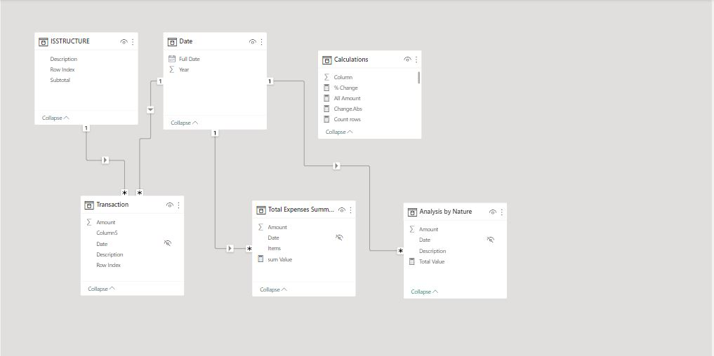
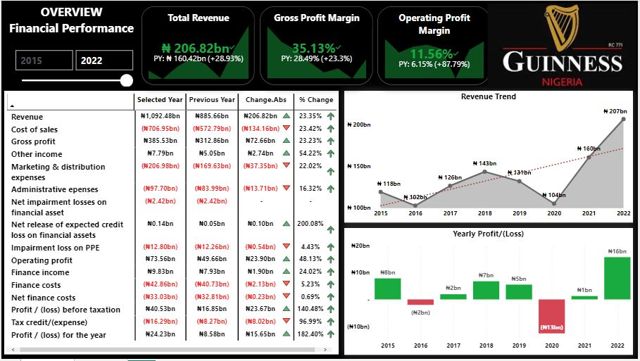

# Guinness NIG PLC Financial Performance Analysis

___

## Introduction
One effective way to evaluate a company's performance is through visualizing its financial data. For **Guinness Nigeria Plc**, I built a financial dashboard based on its profit and loss statement spanning 8 years, this is to provide a general overview of Guinness Nigeria PLC financial performance.

## Data Sourcing
The Nigerian Exchange group (NGX) website was the source of the data for this analysis. The data was then edited and formatted using Excel before being loaded into Power BI for visualization purposes.

## Data Modelling

As a result of the unstructured data generated during the transformation process from NGX, it was necessary to structure the data in a way that would enable smooth visualization in Power BI. This involved creating five tables and manually establishing relationships between them, since the automatic relationship created by Power BI was incorrect. All relationships followed a one-to-many cardinality and featured a one-way filter. Additionally, a separate table was created specifically for calculations using Measures.

## Overview and Visuals

_For dashboard interaction click [here](https://app.powerbi.com/links/32xyhHQ6s1?ctid=f2c35211-7dad-42d6-b895-25d82fc1f0a2&pbi_source=linkShare)_

**Here are some important observations gleaned from the analysis:**
- Guinness Nigeria plc achieved a gross profit margin of 35.13% in 2022, marking an improvement from the previous year's figure of 28.49%. This rise suggests that the company has successfully converted a greater portion of its revenue into gross profit after accounting for the cost of sales.
- The company also saw an improvement in profitability with a higher operating profit margin compared to the previous year.
- Over the eight-year period from 2015 to 2022, Guinness Nigeria plc recorded its highest profit after tax of 15.6 billion. This achievement is attributed to the company's ability to generate enough gross profit to cover its operating costs, finance costs, and other expenses.

**Through the examination of these critical metrics, we can enhance our comprehension of Guinness Nig plc's financial performance and subsequently make well-informed decisions regarding its operations.**
