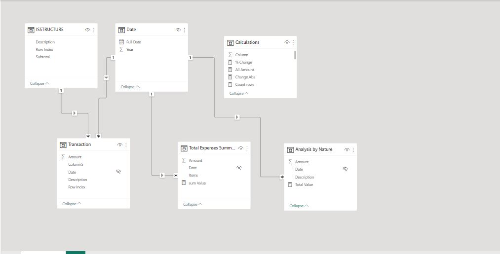

# Guinness NIG PLC Financial Performance Analysis

## Introduction
One effective way to evaluate a company's performance is through visualizing its financial data. For Guinness Nigeria plc, I built a financial dashboard based on its profit and loss statement spanning 8 years, this is to provide a general overview of Guinness Nigeria PLC financial performance.

## Data Sourcing
The Nigerian Exchange group (NGX) website was the source of the data for this analysis. The data was then edited and formatted using Excel before being loaded into Power BI for visualization purposes.

## Data Modelling

As a result of the unstructured data generated during the transformation process from NGX, it was necessary to structure the data in a way that would enable smooth visualization in Power BI. This involved creating five tables and manually establishing relationships between them, since the automatic relationship created by Power BI was incorrect. All relationships followed a one-to-many cardinality and featured a one-way filter. Additionally, a separate table was created specifically for calculations using Measures.

